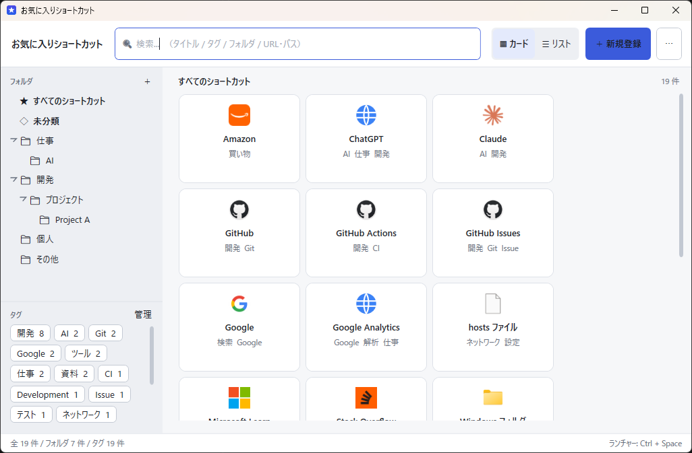
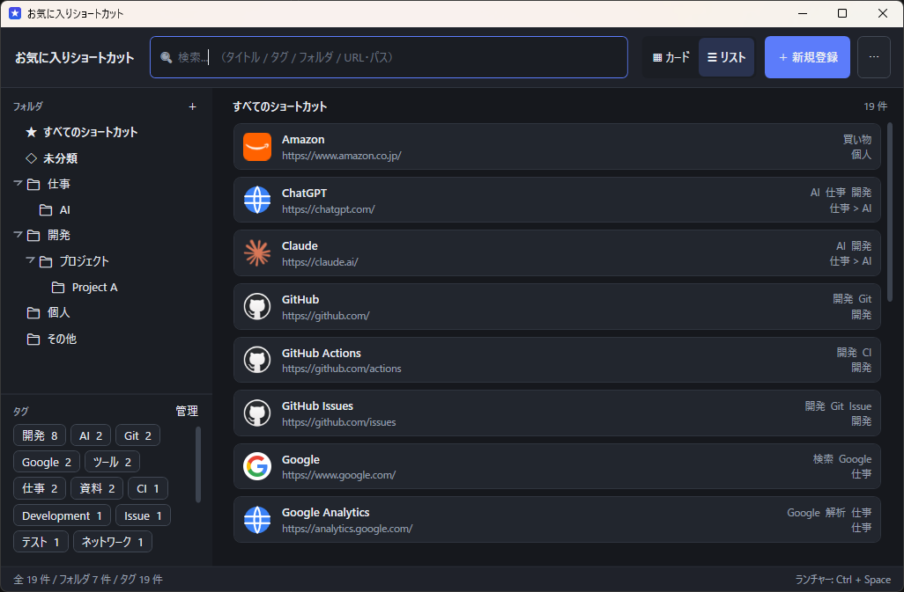
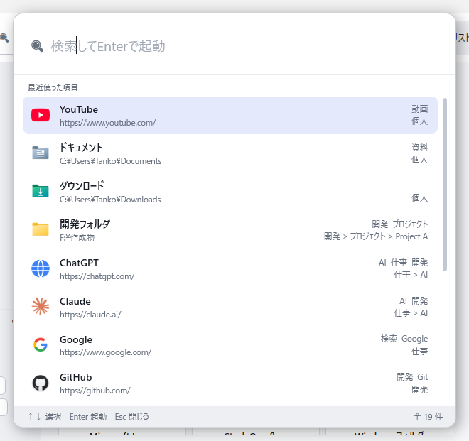
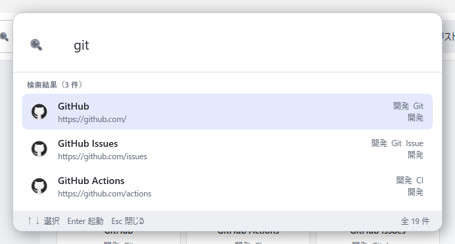
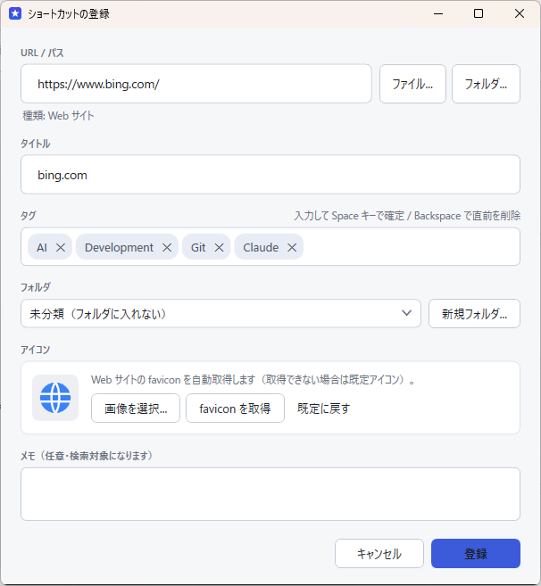
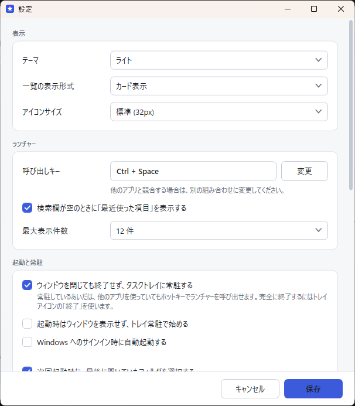

# お気に入りショートカット

Windows 用の「お気に入り管理 + ランチャー」アプリです。
Web サイト・フォルダ・ファイルへのショートカットをフォルダとタグで整理し、
**どのアプリを使っていても `Ctrl + Space` → 検索 → `Enter` の 3 ステップで開ける**ことを目的にしています。

```
整理するとき  →  管理画面（フォルダ / タグ / 登録・編集）
使うとき      →  Ctrl + Space  →  キーワード入力  →  Enter
```

---

## 画面

| 管理画面（カード表示） | 管理画面（リスト表示・ダークテーマ） |
|---|---|
|  |  |

| ランチャー（最近使った項目） | ランチャー（検索中） |
|---|---|
|  |  |

| 登録画面（タグ入力） | 設定 |
|---|---|
|  |  |

---

## 目次

- [できること](#できること)
- [動作環境](#動作環境)
- [セットアップ（利用者向け）](#セットアップ利用者向け)
- [使い方](#使い方)
- [データの保存場所](#データの保存場所)
- [別の PC へ移す（エクスポート / インポート）](#別の-pc-へ移すエクスポート--インポート)
- [ビルド方法（開発者向け）](#ビルド方法開発者向け)
- [テスト](#テスト)
- [技術選定とその理由](#技術選定とその理由)
- [設計メモ](#設計メモ)
- [既知の制限](#既知の制限)

---

## できること

### 登録・整理

- Web URL / フォルダパス / ファイルパス / UNC パス（`\\server\share`）の登録
- 入力内容からの種別自動判定（`https://` → Web、`C:\` → フォルダ / ファイル、拡張子で EXE 判定）
- フォルダによる整理（**階層に対応**。フォルダの中にフォルダを作れます）
- タグ付け（日本語・英語混在可、入力して `Space` で確定）
- エクスプローラーからのドラッグ＆ドロップ登録（複数まとめて登録も可）
- ショートカットをドラッグしてフォルダ間を移動
- アイコン: Web は favicon を自動取得、ファイル / フォルダは Windows のアイコン、任意の画像も指定可

### 探す・開く

- タイトル / タグ / フォルダ名 / URL・パス / メモを横断する部分一致検索
- 複数ワードの AND 検索（`AI 開発` で両方に関係するものだけ）
- 大文字小文字、全角半角、ひらがな / カタカナの違いを吸収
- スコアリングによる並び替え（完全一致 → タイトル先頭一致 → 部分一致 → タグ → フォルダ → URL）
- よく使う項目・最近使った項目をわずかに上位へ
- Web は既定ブラウザ、フォルダはエクスプローラー、ファイルは既定のアプリで起動

### ランチャー

- グローバルホットキー（既定 `Ctrl + Space`、設定で変更可）
- 他のアプリを操作中でも呼び出し可能
- `↑` `↓` で選択、`Enter` で起動、`Esc` で閉じる
- 検索欄が空のときは「最近使った項目」を表示
- タスクトレイ常駐、Windows サインイン時の自動起動（任意）

### データ

- SQLite による保存（都度保存。アプリを閉じても保存漏れが起きません）
- ZIP 形式でのエクスポート / インポート（フォルダ構成・タグ・アイコン・設定ごと）
- インポート前の自動バックアップ
- スキーマのバージョン管理（将来のアップデートでデータを壊さないため）

---

## 動作環境

- Windows 10 (1809 以降) / Windows 11
- 配布形式によって .NET ランタイムの要否が変わります

| 配布形式 | サイズ目安 | .NET 8 デスクトップランタイム |
|---|---|---|
| 自己完結版（推奨） | 約 68 MB | **不要** |
| ランタイム依存版 | 約 2.3 MB | 必要 |

---

## セットアップ（利用者向け）

### 方法 1: ZIP を展開して使う（インストール不要・推奨）

1. `FavoriteShortcut-portable.zip` を任意の場所に展開します
2. `FavoriteShortcut.exe` をダブルクリックします

登録したデータは **EXE と同じ場所に作られる `Data` フォルダ**に保存されます。

```
どこか好きな場所\
├── FavoriteShortcut.exe
└── Data\                  ← 起動すると自動で作られる
    ├── favorite-shortcuts.sqlite
    ├── icons\
    ├── backup\
    └── app.log
```

**このフォルダごとコピーすれば、別の PC でもそのまま同じ内容で使えます。**
USB メモリに入れて持ち運ぶこともできます。

### 方法 2: インストーラーを使う

`FavoriteShortcut-Setup.exe` を実行し、画面の指示に従ってください。

### 初回起動時

- 「仕事 / 開発 / 個人 / その他」の空フォルダが作られます（不要なら削除してください）
- グローバルホットキー `Ctrl + Space` が登録されます
  - **他のアプリや IME が `Ctrl + Space` を使っている場合は登録に失敗します。**
    画面下部のステータスバーに「未登録」と表示されるので、
    `⋯` → 設定 → ランチャー → 呼び出しキーで別の組み合わせに変更してください。

---

## 使い方

### 登録する

| 方法 | 手順 |
|---|---|
| ボタンから | `＋ 新規登録` をクリック（`Ctrl + N`） |
| ドラッグ＆ドロップ | エクスプローラーからファイル / フォルダを一覧へドロップ |
| URL の貼り付け | ブラウザのアドレスバーから URL を一覧へドロップ |

URL / パスを入れるとタイトルが自動で補完され、種別（Web / フォルダ / ファイル）が判定されます。

### タグを入力する

タグ欄に文字を入力し **`Space` キー**を押すとタグが確定します。

```
AI [Space]              →  [AI ✕]
開発 [Space]            →  [AI ✕] [開発 ✕]
Claude [Space]          →  [AI ✕] [開発 ✕] [Claude ✕]
```

- `Backspace`（入力欄が空のとき）で直前のタグを削除
- `✕` をクリックしても削除できます
- 既存のタグは入力中に候補として表示されます（`↓` で選んで `Enter`）
- 大文字小文字違いの同じタグは重複登録されません

**日本語入力について**: IME で変換中に押す `Space`（変換キー）や、変換確定の `Enter` は
タグ確定として扱われません。`かいはつ` → `Space` で「開発」に変換 → `Enter` で確定 →
もう一度 `Space` でタグ確定、という自然な流れで入力できます。

### 検索する

画面上部の検索欄（`Ctrl + F`）に入力すると、以下がすべて検索対象になります。

- タイトル
- タグ
- フォルダ名（`仕事 > AI` のような階層パス全体）
- URL / ファイルパス
- メモ

```
ChatGPT       → タイトルでヒット
AI            → タグでヒット
仕事          → フォルダ名でヒット
chatgpt.com   → URL でヒット
analytics     → 「Google Analytics」に部分一致
AI 開発       → 両方に関係するものだけ（AND 検索）
```

`Esc` で検索条件をクリアします。

### ランチャーを使う

```
Ctrl + Space      ランチャーを表示（もう一度押すと閉じる）
文字を入力         リアルタイムに検索
↑ ↓ / Tab         候補を選択
Enter             選択中のショートカットを起動
Esc               閉じる
右クリック         開く / 編集 / パスをコピー / 保存先を開く / 削除
```

ランチャーは**マウスカーソルのあるモニター**に表示されます。

### キーボードショートカット（管理画面）

| キー | 動作 |
|---|---|
| `Ctrl + F` | 検索欄へフォーカス |
| `Ctrl + N` | 新規登録 |
| `Enter` | 選択中のショートカットを開く |
| `F2` | 編集 |
| `Delete` | 削除（確認あり） |
| `Ctrl + C` | URL / パスをコピー |
| `Esc` | 検索条件のクリア |

### タスクトレイ

ウィンドウの `✕` を押してもアプリは終了せず、タスクトレイに常駐します
（ホットキーを使い続けるため）。完全に終了するには、トレイアイコンを右クリック →「終了」。

この動作は 設定 → 起動と常駐 で変更できます。

---

## データの保存場所

**EXE と同じ場所の `Data` フォルダ**に保存されます。

```
FavoriteShortcut.exe があるフォルダ\
└── Data\
    ├── favorite-shortcuts.sqlite   データベース本体
    ├── icons\                      favicon キャッシュ / カスタムアイコン
    ├── backup\                     自動バックアップ（最新 10 世代）
    └── app.log                     動作ログ
```

EXE と `Data` フォルダを一緒にコピーするだけで、別の PC へそのまま移せます
（エクスポート / インポートを使わなくても移動できます）。
`⋯` →「データ保存場所を開く」から実際の場所を開けます。

### 保存場所の決まり方

上から順に判定し、最初に見つかったものを使います。

1. 環境変数 `FAVORITESHORTCUT_DATA_DIR`
2. EXE と同じ場所の `location.json`（設定画面で変更したとき）
3. `%APPDATA%\お気に入りショートカット\location.json`（EXE 側に書けない環境で変更したとき）
4. **EXE と同じ場所の `Data`** ← 既定
5. 4 に書き込めない場合のみ `%APPDATA%\お気に入りショートカット\`

**5 になるのは `C:\Program Files\` 配下など、書き込みが許可されていない場所に置いた場合だけ**です。
その場合は設定画面にその旨が表示されます。EXE をデスクトップやドキュメント、USB メモリなど
書き込める場所へ移せば、4 の動作に戻ります。

### 保存場所を変える

- **設定 → データ → 保存場所を変更**（次回起動から有効）
- **環境変数 `FAVORITESHORTCUT_DATA_DIR`**（1 台の PC で複数のデータを使い分けたいときに便利）

> 保存場所を変えても**データは自動では移動しません**。
> 先にエクスポートし、新しい場所で起動してからインポートしてください。

---

## 別の PC へ移す（エクスポート / インポート）

```
PC A  →  ⋯ → エクスポート  →  favorite-shortcuts-YYYYMMDD-HHMMSS.zip
      →  USB / OneDrive / Google Drive 等で移動
PC B  →  ⋯ → インポート     →  復元
```

ZIP の中身:

```
database.sqlite   フォルダ・ショートカット・タグ・使用履歴・設定
icons/            使用中のアイコンファイル
settings.json     設定（人が読める形。参照用）
manifest.json     アプリ名 / バージョン / スキーマ版 / 件数
```

インポート時は 2 つの方法を選べます。

| 方法 | 動作 |
|---|---|
| **現在のデータを残して追加** | 同じ構成のフォルダはまとめ、まったく同じ内容のショートカットはスキップ |
| **現在のデータをすべて置き換える** | 今ある内容を削除してから取り込む |

どちらの場合も、**取り込み直前に現在のデータを自動バックアップ**します
（`backup\YYYYMMDD-HHMMSS-import-before.sqlite`）。

### ローカルパスについて

登録したローカルパス（`C:\Users\Taro\Documents` など）は、
PC が変わるとそのまま使えないことがあります。
現時点ではパスの自動置換は行いません。移行先で個別に編集してください。
（将来「パス置換」機能を追加できるよう、対象の種別とパスは分けて保存しています。）

---

## ビルド方法（開発者向け）

### 必要なもの

- [.NET 8 SDK](https://dotnet.microsoft.com/download/dotnet/8.0)（Windows）
- 追加の外部ツールは不要です

### フォルダ構成

```
FavoriteShortcut/
├── README.md
├── FavoriteShortcut.sln
├── src/FavoriteShortcut/        アプリ本体
│   ├── Models/                  データモデル
│   ├── Data/                    SQLite（接続・スキーマ・CRUD）
│   ├── Services/                検索・起動・アイコン・ホットキー・入出力
│   ├── Views/                   画面
│   ├── Controls/                タグ入力コントロール
│   ├── Themes/                  配色と共通スタイル
│   └── Assets/                  アプリアイコン
├── tests/FavoriteShortcut.Tests/ 検証プログラム
├── scripts/                     ビルド用スクリプト
├── installer/                   Inno Setup 用スクリプト
├── build/                       ビルド成果物（生成物）
└── docs/                        スクリーンショット等
```

### 開発ビルドと実行

```powershell
dotnet build
dotnet run --project src\FavoriteShortcut
```

### 配布用ビルド

```powershell
# 自己完結版（.NET 不要。配布はこちらを推奨）
powershell -ExecutionPolicy Bypass -File scripts\build.ps1

# ランタイム依存版（小さいが .NET 8 デスクトップランタイムが必要）
powershell -ExecutionPolicy Bypass -File scripts\build.ps1 -Mode FrameworkDependent

# 両方
powershell -ExecutionPolicy Bypass -File scripts\build.ps1 -Mode Both
```

生成物:

```
build\
├── self-contained\FavoriteShortcut.exe        単体で動く EXE（配布用）
├── framework-dependent\FavoriteShortcut.exe   .NET 8 が必要な EXE
└── FavoriteShortcut-portable.zip              展開してすぐ使える ZIP
```

`-Mode SelfContained` は単一ファイル（`PublishSingleFile`）かつ ReadyToRun で発行します。
初回起動時にネイティブライブラリが一時フォルダへ展開されるため、初回だけ少し時間がかかります。

### インストーラー

[Inno Setup 6](https://jrsoftware.org/isinfo.php) をインストールしたうえで:

```powershell
powershell -ExecutionPolicy Bypass -File scripts\build.ps1
& "C:\Program Files (x86)\Inno Setup 6\ISCC.exe" installer\FavoriteShortcut.iss
```

`installer\FavoriteShortcut-Setup.exe` が生成されます。

---

## テスト

外部のテストフレームワークを使わない、`dotnet run` だけで動く検証プログラムを同梱しています。
一時フォルダをデータ保存場所として使うため、実データには影響しません。

```powershell
dotnet run --project tests\FavoriteShortcut.Tests
```

検証内容（開発指示書 §44 に対応）:

| 区分 | 内容 |
|---|---|
| 種別判定 | Web / フォルダ / ファイル / EXE / UNC / 存在しないパス / URL 正規化 |
| 文字列正規化 | 大文字小文字、全角半角、ひらがな↔カタカナ、全角スペース |
| CRUD | フォルダ階層、名前変更、循環参照の防止、削除時の挙動、タグの追加・改名・自動整理 |
| 検索 | タイトル / タグ / フォルダ / URL、部分一致、AND 検索、並び順、使用頻度 |
| 性能 | 10,000 件からの検索が 1 秒以内（実測: 約 40ms） |
| 設定 | 保存と再読み込み |
| 移植 | エクスポート → インポート（置き換え / 追加）、階層・タグ・アイコン・使用履歴・設定の保持、二重取り込みの抑止、ZIP の安全な展開 |
| 永続化 | 再起動後のデータ保持、スキーマバージョン、将来バージョンの DB を開かない |

**手動で確認が必要な項目**（自動化できないもの）:

- 日本語 IME でのタグ入力（変換用 `Space` がタグ確定にならないこと）
- グローバルホットキーが他アプリ使用中に反応すること
- エクスプローラーからのドラッグ＆ドロップ
- マルチモニター環境でのランチャー表示位置

---

## 技術選定とその理由

### 採用: .NET 8 + WPF（C#）

| 要件 | .NET 8 / WPF | Electron | Tauri |
|---|---|---|---|
| 軽量・起動が速い | ◎ ネイティブ、常駐しても数十 MB | △ Chromium 同梱 | ◎ |
| 日本語 IME | ◎ OS ネイティブの入力処理 | △ WebView 依存 | △ WebView 依存 |
| グローバルホットキー | ◎ `RegisterHotKey` を直接利用 | ○ | ○ |
| タスクトレイ常駐 | ◎ | ○ | ○ |
| Windows のファイルアイコン取得 | ◎ `SHGetFileInfo` を直接利用 | △ | △ |
| エクスプローラーからの D&D | ◎ | ○ | △ |
| SQLite | ◎ `Microsoft.Data.Sqlite` | ○ | ○ |
| EXE 化 | ◎ 単一ファイル発行 | ○ | ◎ |
| ビルド環境 | ◎ .NET SDK のみ | Node.js | Rust + MSVC |

**決め手**:

1. **常駐ランチャーである**こと。バックグラウンドで常に動き続けるので、メモリ使用量と
   ホットキー応答の速さが最重要。Chromium を常駐させる Electron は要件（§31「不要に巨大な
   ランタイムを含めない」）に合いません。
2. **日本語 IME の扱いがシビア**であること（§32）。タグ確定の `Space` と IME の変換
   `Space` の競合は、WPF なら `Key.ImeProcessed` で正確に判別できます。
3. **Windows シェルとの統合**（ファイルアイコン、エクスプローラー連携）が多いこと。
4. Tauri は軽量ですが、ビルドに Rust + MSVC ツールチェーンが必要で、
   IME とシェル統合は結局 WebView 頼みになります。

### EXE 化の方法

`dotnet publish` の単一ファイル発行を使います。

```
-p:PublishSingleFile=true
-p:IncludeNativeLibrariesForSelfExtract=true   ← SQLite のネイティブ DLL を同梱
-p:PublishReadyToRun=true                      ← 起動を速くする
--self-contained true                          ← .NET ランタイムを同梱
```

WPF アプリはトリミング（`PublishTrimmed`）に対応していないため、自己完結版は圧縮後で
約 68 MB になります。サイズを優先する場合はランタイム依存版（約 2.3 MB）を使ってください
（配布先に .NET 8 デスクトップランタイムが必要です）。

### SQLite の使い方

- `Microsoft.Data.Sqlite`（`SQLitePCLRaw` によりネイティブ DLL を同梱、別途インストール不要）
- `journal_mode=WAL` + `synchronous=NORMAL`: 予期せぬ終了時もデータが壊れにくい構成
- `foreign_keys=ON`: フォルダ削除時のカスケード / SET NULL を DB 側で保証
- スキーマ版は `PRAGMA user_version` で管理し、起動時に不足分のみ適用
- エクスポート時は `VACUUM INTO` で整合性のとれたコピーを作成（ファイルコピーより安全）
- 検索は全件をメモリに読み込んで行います（10,000 件でも約 40ms）。
  書き込みは常に SQLite へ即時反映します。

### アイコンの取得方法

| 種別 | 方法 |
|---|---|
| Web | サイトの HTML から `<link rel="icon">` を解析 → 取得できなければ `/favicon.ico` |
| フォルダ | `SHGetFileInfo` + `SHGetImageList`（48px）でシェルのアイコン |
| ファイル | 同上。EXE / LNK / ICO は実体固有のアイコンを取得 |
| カスタム | ユーザーが選んだ画像を `icons\` へコピー |
| 取得失敗時 | 種別ごとのベクターアイコン（どの DPI でも滲みません） |

favicon は `icons\fav_<ホスト名のハッシュ>.png` としてキャッシュするので、
**オフラインでも表示できます**。同じサイトのショートカット同士でキャッシュを共有します。

外部のアイコン取得サービス（Google の favicon API）は**既定で無効**です。
有効にするとドメイン名が外部へ送信されるため、設定画面で明示的にオンにしたときだけ使います。

---

## 設計メモ

### タグ入力と日本語 IME（§5, §32）

WPF では、IME が処理したキーは `KeyEventArgs.Key == Key.ImeProcessed` として通知されます。
`PreviewKeyDown` の先頭でこれを弾くことで、変換中の `Space` / 確定の `Enter` を
タグ確定として扱わないようにしています。

加えて、IME が全角スペース（`　`）を直接入力する構成もあるため、
`TextChanged` 側でも半角 / 全角スペース・カンマ・読点を区切りとして拾う二重の作りにしています。

（実装: [`Controls/TagInputControl.xaml.cs`](src/FavoriteShortcut/Controls/TagInputControl.xaml.cs)）

### 検索のスコアリング（§55）

```
完全一致（タイトル）      1000
タイトル先頭一致           700
タイトル部分一致           500
タグ完全一致               460
タグ先頭一致               380
タグ部分一致               320
フォルダ名一致          240-300
URL / パス一致          200-260
メモ一致                    90
──────────────────────────
使用頻度・最近使ったか  +最大150
```

複数ワードは AND 条件で、語ごとの最良スコアを合算します。
使用頻度の加点は「入力した語との一致」を覆さない程度に抑えています（§57）。

### データを壊さないための工夫（§47）

- WAL による書き込み保護
- スキーマの `user_version` 管理と、**将来バージョンの DB を開かない**チェック
- インポート前の自動バックアップ（最新 10 世代を保持）
- エクスポートは `VACUUM INTO` による整合性のとれたコピー
- ZIP 展開時、展開先の外に出るパス（Zip Slip）を無視
- 対象ファイルが見つからなくても、**DB 上のショートカットは自動削除しません**（§33）
- UI スレッドで例外が起きてもアプリを落とさず、ログに残して継続

---

## 既知の制限

| 項目 | 内容 |
|---|---|
| カード表示の件数 | カード表示は仮想化できないため、1,000 件を超えると先頭 1,000 件のみ表示します（画面上に通知が出ます）。検索で絞るか、リスト表示に切り替えるとすべて表示できます。リスト表示は件数制限なし。 |
| パスの自動置換 | PC 間でユーザー名などが違う場合、ローカルパスは手動で修正が必要です。 |
| 書き込めない場所への配置 | `C:\Program Files\` 配下などに置くと、データは `%APPDATA%` へ退避されます（設定画面に表示されます）。 |
| ホットキーの競合 | `Ctrl + Space` を IME や他アプリが使用している場合、登録に失敗します。設定から変更してください。 |
| ゴミ箱 | 削除は即時で、元に戻せません（確認ダイアログあり）。定期的なエクスポートを推奨します。 |
| クラウド同期 | 未対応です。エクスポート ZIP を共有ストレージ経由で受け渡してください。 |
| インストーラー | Inno Setup が必要です（同梱スクリプトから生成できます）。 |

---

## ライセンス / 作者

個人利用を想定した内製アプリです。
